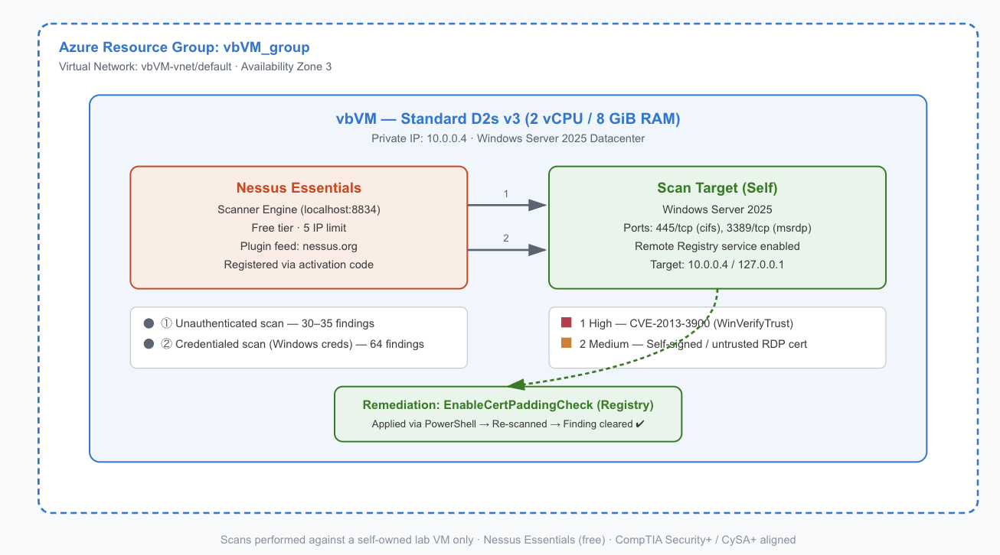

# Lab 5 — Nessus Vulnerability Scanning

**Nessus Essentials (Free) · Azure Lab VM · CompTIA Security+ / CySA+**



---

## Overview

| Field | Value |
|---|---|
| Certification alignment | CompTIA Security+ · CySA+ · PenTest+ |
| Tooling | Nessus Essentials (free, 5-IP limit) |
| Environment | Azure VM — Windows Server 2025 Datacenter, Standard D2s v3 |
| Time to complete | ~4 hours (including troubleshooting) |
| Cost | £0 |

This lab covers the core vulnerability management lifecycle: **scan → find → remediate → verify**. This is the same loop security teams run continuously in production, just at a larger scale with more automation layered on top. The goal wasn't just to run a scanner — it was to understand *why* a finding matters, fix it at the source, and prove the fix actually worked.

---

## What I Did

### 1. Deployed Nessus Essentials on an Azure VM

Installed Nessus Essentials directly on the same Windows Server 2025 VM used in earlier labs (Standard D2s v3, 2 vCPU / 8 GiB RAM), registered with a free activation code (5 IP limit), and brought the plugin feed up to date.

**Real-world troubleshooting note:** the initial plugin compilation stalled at 0% with CPU pinned at ~97–99%. Diagnosis in Task Manager traced it to Windows Defender's **Antimalware Service Executable**, which was real-time scanning Nessus's newly installed files and starving the actual `nessusd` process of CPU. Resolved by adding Defender exclusions for both `C:\Program Files\Tenable\Nessus` and `C:\ProgramData\Tenable\Nessus`, followed by a service restart. After a reboot interrupted the plugin state, plugins had to be manually re-pulled with:

```powershell
cd "C:\Program Files\Tenable\Nessus"
.\nessuscli.exe update --all
Restart-Service -Name "Tenable Nessus" -Force
```

This is a good example of a common real-world friction point: security tools competing with each other for system resources, and the debugging process to isolate and resolve it.


### 2. Ran an Unauthenticated Discovery Scan

**Basic Network Scan** against the VM itself (`127.0.0.1` and `10.0.0.4`), simulating what an external, unauthenticated attacker could see from outside.

- **Result:** ~30–35 findings, mostly Medium/Info severity, primarily SSL/certificate-related.

### 3. Ran a Credentialed Scan

Enabled the **Remote Registry** service, supplied local Windows admin credentials to Nessus, and re-scanned the same host.

```powershell
Set-Service -Name RemoteRegistry -StartupType Automatic
Start-Service RemoteRegistry
```

- **Result:** **64 findings** — roughly double the unauthenticated scan — including one **High** severity finding. This is the expected pattern: credentialed scans authenticate to the host and inspect it from the inside, surfacing missing patches, registry weaknesses, and configuration issues that an outside-only scan can't see.

### 4. Remediated and Verified a High-Severity Finding

| Finding | Severity | CVE |
|---|---|---|
| WinVerifyTrust Signature Validation Mitigation missing | **High** | CVE-2013-3900 |

**Root cause:** missing `EnableCertPaddingCheck` registry values, which — if left unset — could allow an attacker to append arbitrary data to a signed executable without invalidating its digital signature.

**Fix applied:**

```powershell
New-Item -Path "HKLM:\SOFTWARE\Microsoft\Cryptography\Wintrust\Config" -Force
New-ItemProperty -Path "HKLM:\SOFTWARE\Microsoft\Cryptography\Wintrust\Config" `
  -Name "EnableCertPaddingCheck" -Value 1 -PropertyType DWORD -Force

New-Item -Path "HKLM:\SOFTWARE\Wow6432Node\Microsoft\Cryptography\Wintrust\Config" -Force
New-ItemProperty -Path "HKLM:\SOFTWARE\Wow6432Node\Microsoft\Cryptography\Wintrust\Config" `
  -Name "EnableCertPaddingCheck" -Value 1 -PropertyType DWORD -Force
```

**Verification:** re-ran the credentialed scan. The CVE-2013-3900 finding no longer appeared — confirming the remediation was effective. This find → fix → verify loop is the single most important habit in vulnerability management; a fix that's never verified is just a guess.

### 5. Reviewed Remaining Findings

Two **Medium** severity findings remained after remediation, both related to the VM's self-signed RDP certificate (untrusted certificate chain). These were assessed and consciously left as-is:

- Self-signed certificates are expected and low-risk on an internal lab VM with no public-facing production traffic.
- Fixing this properly would require standing up a CA and issuing a trusted certificate — disproportionate effort for a lab environment, but noted here as the correct remediation path for a production host (`Purchase or generate a proper SSL certificate for this service`).

This is a deliberate example of **risk-based prioritisation** — not every finding needs to be fixed immediately; part of the job is judging which ones actually matter given the context of the asset.

---

## Results Summary

| Scan Type | Target | Findings | Notes |
|---|---|---|---|
| Unauthenticated (Basic Network Scan) | `127.0.0.1` | 35 | External-facing view |
| Unauthenticated (Basic Network Scan) | `10.0.0.4` | 32 | Same host, network interface |
| Credentialed | `10.0.0.4` | 64 → 63 | 1 High finding remediated and verified |

---

## Findings & Fixes

| # | Finding | Severity | Status | Action Taken |
|---|---|---|---|---|
| 1 | WinVerifyTrust Signature Validation Mitigation missing (**CVE-2013-3900**) | **High** | ✅ Fixed & verified | Added `EnableCertPaddingCheck` DWORD registry values under both `Wintrust\Config` and `Wow6432Node\Wintrust\Config`; re-scanned to confirm removal |
| 2 | SSL Self-Signed Certificate (RDP, port 3389) | Medium | ⏸ Accepted (documented) | Expected on an internal lab VM with no public traffic; correct fix for production is a CA-signed certificate |
| 3 | SSL Certificate Cannot Be Trusted (RDP, port 3389) | Medium | ⏸ Accepted (documented) | Same root cause as #2 — untrusted chain from the self-signed cert |
| 4–7 | Various Info-level SSL/service disclosures | Info | ℹ️ No action needed | Informational only, no exploitable risk |

**Before / after remediation:**

| Metric | Before | After |
|---|---|---|
| Total findings (credentialed scan) | 64 | 63 |
| High severity findings | 1 | 0 |
| Medium severity findings | 3 | 2 |

---

## Issues Encountered During This Lab

Troubleshooting was a bigger part of this lab than the scanning itself, and is documented here because working through infrastructure friction is a core part of the job.

| Issue | Symptom | Root Cause | Resolution |
|---|---|---|---|
| Plugin download/compile stalled | Nessus stuck at "Initializing / Downloading plugins…" for 40+ minutes; PowerShell itself became sluggish | Task Manager showed CPU pinned at 97–99%. Sorting by CPU identified **Antimalware Service Executable** (Windows Defender) at ~90% — real-time scanning Nessus's newly written files and starving the actual `nessusd` process | Added Defender exclusions for `C:\Program Files\Tenable\Nessus` and `C:\ProgramData\Tenable\Nessus`; restarted the VM to force the exclusions to take effect cleanly |
| `Restart-Service -Name WinDefend -Force` failed | `Cannot open WinDefend service` error | Windows Defender blocks its own service from being manually stopped/restarted as a self-protection measure | Skipped restarting Defender directly; used a full VM restart instead, which applied the exclusions without needing to touch the Defender service |
| "Nessus has no plugins. Therefore, functionality is limited." after reboot | Scans page showed a plugin warning; scan creation was blocked | The VM restart interrupted the plugin compile mid-process, leaving Nessus in a partial/empty plugin state | Ran `nessuscli.exe update --all` from `C:\Program Files\Tenable\Nessus` to force a full re-fetch and re-process of the plugin feed, then restarted the **Tenable Nessus** service (`Restart-Service -Name "Tenable Nessus" -Force`) |
| Uncertainty over scan target | Unsure whether to scan by public IP, private IP, or `127.0.0.1`, and whether cross-VNet scanning (to a separate Ubuntu VM) would work | Nessus and the intended target were the same VM; a separate Ubuntu VM was on a peered but distinct VNet | Confirmed Nessus and target were the same host, so scanned via `127.0.0.1` and the private IP `10.0.0.4` directly — avoided unnecessary NSG/peering troubleshooting for this lab's scope |

**Takeaway:** the most time-consuming part of this lab wasn't running Nessus — it was correctly diagnosing *why* it was slow before reaching for a fix. Jumping straight to "reinstall" or "use a bigger VM" would have masked the real cause (Defender/AV contention), which is exactly the kind of resource-contention issue that shows up in real enterprise environments running EDR alongside vulnerability scanners.

---

## Skills Demonstrated

- Deploying and licensing a commercial-grade vulnerability scanner (Nessus Essentials)
- Configuring credentialed scanning (Remote Registry, Windows auth) for deep host inspection
- Reading and interpreting CVSS scores and CVE references to assess real-world risk
- Troubleshooting real infrastructure conflicts (AV vs. scanner resource contention) using Task Manager and PowerShell
- Applying registry-level remediation via PowerShell
- Verifying remediation effectiveness through re-scanning — not just claiming a fix works
- Risk-based prioritisation: knowing which findings to fix now vs. accept and document

---

## Notes

Scans were run exclusively against a VM I own and control, in line with responsible scanning practice — Nessus scan traffic is indistinguishable from an attack probe to any monitoring system in the path, so scope discipline matters even in a lab.
